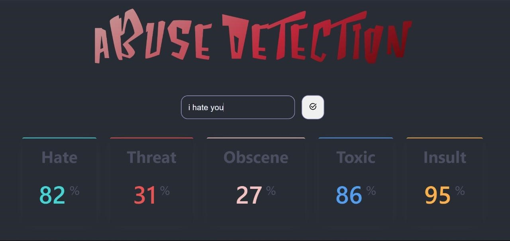
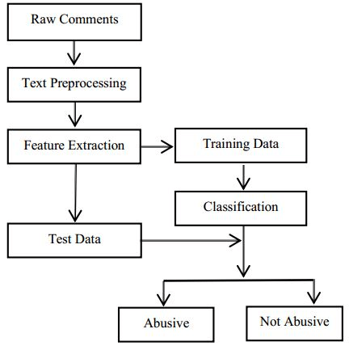

## About

Abuse detection is the task of identifying abusive behaviors, such as hate speech, offensive language, sexism and racism, in utterances from social media platforms.
With the advent of pervasive usage of online platforms, online abusive behaviour has become an indispensable part of our life demanding great attention from the research community. Accordingly, the research community is spending its effort on the demanding task, however, perhaps having much less effort on emails, even though emails are identified as a prominent source of exchanging online abusive behaviours.  To fill in this gap in the literature, we conduct an in-depth study to investigate online abusive behaviour having a special focus on emails. **Our system will help in finding out whether a certain text or sentence in english is abusive or not using 5 parameters**.

## Software used
●	Python libraries:  NumPy, TensorFlow, Keras, Matplotlib, OpenCV, Scikit-learn 
●	Python compiler: (Jupyter notebook) 
●	Dataset (collected from the Kaggle) 
●	Machine Learning Algorithm:  TfidVectorizer   
●	EDA (Exploratory Data Analysis) 

## Preview of the application

## Flow chart

